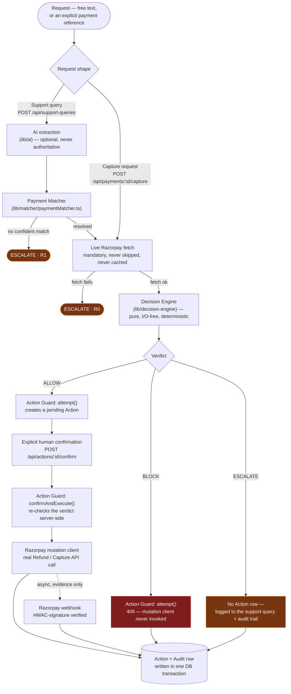
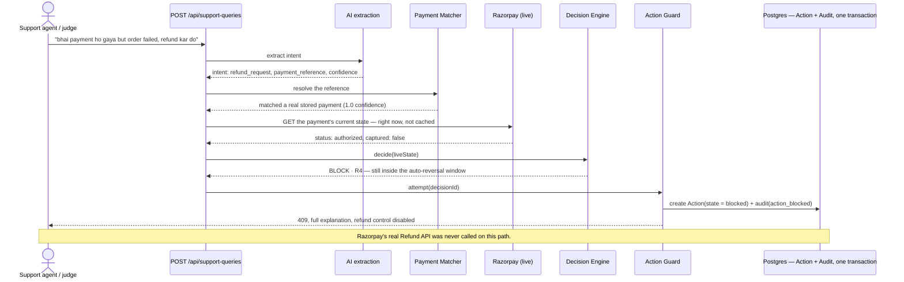
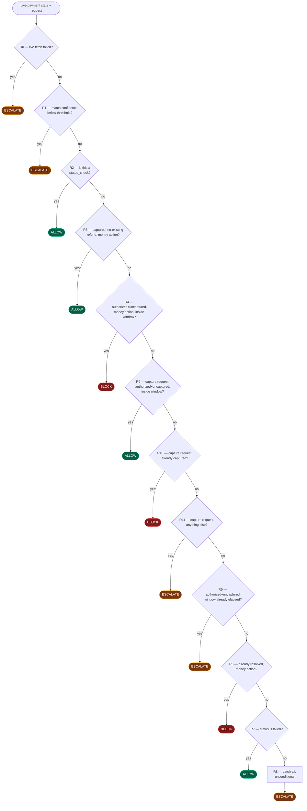
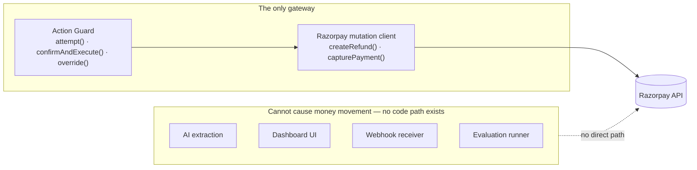
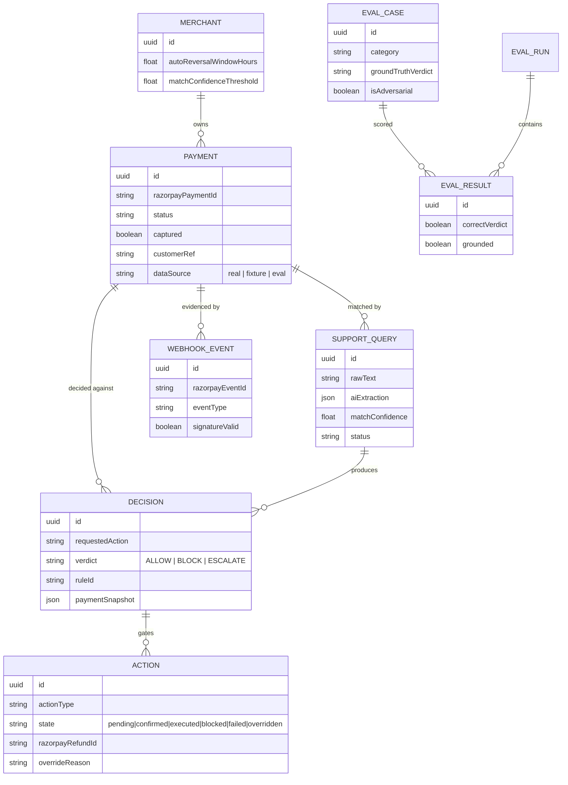

<div align="center">

# CaptureGuard

**A safety layer between AI and money.**
AI reads what a customer wants. It never decides what happens to their payment.

[](https://nextjs.org)
[](https://react.dev)
[](https://www.typescriptlang.org)
[](https://www.prisma.io)
[](https://www.postgresql.org)
[](https://razorpay.com)
[](https://vitest.dev)

Built for the **Razorpay AI Buildathon** — every payment, decision, and mutation shown in this repo's demo is a real Razorpay Test Mode object. Nothing is simulated.

</div>

---

> A support agent — human or AI — can misread a situation. What it must never be able to
> do is act on that misreading with someone's money. CaptureGuard is the boundary that
> makes that structurally impossible, not just policy.

## Contents

1. [The problem](#1-the-problem)
2. [The core insight](#2-the-core-insight)
3. [Architecture](#3-architecture)
4. [Request lifecycle, end to end](#4-request-lifecycle-end-to-end)
5. [The three verdicts](#5-the-three-verdicts)
6. [The Decision Engine — R0 through R11, in real order](#6-the-decision-engine--r0-through-r11-in-real-order)
7. [Action Guard — the one gateway to real money movement](#7-action-guard--the-one-gateway-to-real-money-movement)
8. [AI's role, and its limits](#8-ais-role-and-its-limits)
9. [Data model](#9-data-model)
10. [Razorpay integration](#10-razorpay-integration)
11. [Webhook verification](#11-webhook-verification)
12. [The three real scenarios, run live](#12-the-three-real-scenarios-run-live)
13. [Judge Demo / Test Lab](#13-judge-demo--test-lab)
14. [Tech stack](#14-tech-stack)
15. [Local setup](#15-local-setup)
16. [Running & testing](#16-running--testing)
17. [Deployment](#17-deployment)
18. [Security / design invariants](#18-security--design-invariants)
19. [Known limitation](#19-known-limitation)
20. [Demo flow for judges](#20-demo-flow-for-judges)

---

## 1. The problem

AI support agents are good at understanding what a customer is asking for. They are
**not** a reliable source of truth about what actually happened to a payment.

Here's the specific, expensive gap this creates on Razorpay: a payment can sit
`authorized` but not yet `captured` — the charge is real, but Razorpay hasn't finalized
it, and Razorpay will **automatically reverse it on its own** within a set window if
nothing happens. If a support agent (human or AI) sees "order failed, please refund" and
manually refunds that payment *before* Razorpay's own reversal completes, the customer
has now been paid twice — once by Razorpay's automatic reversal, once by the agent. The
merchant eats the difference, and nobody notices until reconciliation.

That failure doesn't require a malicious actor or a buggy model. It just requires an AI
system that is trusted to both **interpret** a request and **decide** whether to act on
it, with no independent check between the two.

## 2. The core insight

**AI interprets. Razorpay's live state decides.**

Those are two separate jobs, enforced as two separate code paths everywhere in this
repository:

- AI extraction produces a *proposed* intent. It is never treated as authoritative.
- Every gated decision **re-fetches the payment directly from Razorpay** before deciding
  anything — a cached row or a previously-received webhook is never sufficient on its
  own for a money-moving decision.
- The rule engine that turns that live state into a verdict is **pure and
  deterministic** — same input, same rule, same verdict, every time, with no model call
  in the loop.

## 3. Architecture



Two request shapes drive this pipeline today:

- **Support queries** (`POST /api/support-queries`) — free text, run through AI/fallback
  extraction and payment matching before the live-state check. This is the
  refund/compensation path (rules R0–R8).
- **Capture requests** (`POST /api/payments/:id/capture`) — an explicit payment
  reference, no AI extraction needed (there's nothing to interpret when the payment is
  already named). This is the **capture-mirror** path (rules R9–R11), added on top of
  the original refund flow with zero changes to R0–R8.

## 4. Request lifecycle, end to end

A concrete walkthrough of the flagship case — a refund requested on a payment Razorpay
is already about to reverse on its own:



Compare that to the ALLOW path: the same pipeline runs, but `attempt()` creates a
**pending** action instead of a blocked one, and nothing hits Razorpay until a human
explicitly calls `confirmAndExecute()` — which re-checks the verdict server-side rather
than trusting whatever a UI button showed a moment earlier.

## 5. The three verdicts

Every decision produces exactly one of three outcomes. There is no fourth option and no
partial verdict.

| Verdict | Meaning | Can it be bypassed? |
|---|---|---|
| 🟢 **ALLOW** | The ordinary, unambiguous case. | A mutation may proceed, but only after an explicit confirmation step — never automatically. |
| 🔴 **BLOCK** | Acting now would very likely cause harm — most commonly, Razorpay is already reversing the payment automatically, and a manual action would double-pay the customer. | Only via a typed, non-empty **override reason** — itself a permanently audited event, never silent. |
| 🟡 **ESCALATE** | The system doesn't have enough to decide safely either way — the live fetch failed, the match wasn't confident, or the state matches no known-safe pattern. | Not applicable — this hands the decision to a human; it never auto-resolves. |

**CaptureGuard never guesses toward permission.** Every failure mode you can construct —
a timeout, an ambiguous reference, an unrecognized combination of state — collapses to
ESCALATE, never to ALLOW.

## 6. The Decision Engine — R0 through R11, in real order

`lib/decision-engine/rules.ts` evaluates this table **strictly in the order below —
first match wins** — which is *not* numeric order (R9–R11, the capture-mirror rules,
were inserted between R4 and R5 rather than appended at the end). The table ends in an
unconditional catch-all, so the engine always produces a verdict and never throws.



| Rule | Verdict | One line |
|---|---|---|
| R0 | ESCALATE | Live Razorpay fetch failed — never gate a money decision on stale or missing data. |
| R1 | ESCALATE | Payment reference match confidence below threshold — never guess at a reference. |
| R2 | ALLOW | A pure status check — never blocks information. |
| R3 | ALLOW | Captured, no existing refund — the ordinary, unambiguous refund case. |
| R4 | BLOCK | Authorized but uncaptured, still inside Razorpay's own reversal window. |
| R9 | ALLOW | Capture requested on that same in-window state — exactly what capture is for. |
| R10 | BLOCK | Capture requested on an already-captured payment — never double-capture. |
| R11 | ESCALATE | Capture requested on any other state — never guess on a capture. |
| R5 | ESCALATE | Authorized+uncaptured, but the window has elapsed with nothing observed. |
| R6 | BLOCK | Already resolved (refunded/auto-reversed) — never double-refund. |
| R7 | ALLOW | Payment failed at the bank — informational only, nothing to protect. |
| R8 | ESCALATE | Unconditional catch-all — an unrecognized combination is never guessed at. |

## 7. Action Guard — the one gateway to real money movement

`lib/action-guard/actionGuard.ts`, together with `lib/razorpay/mutationClient.ts`, are
the **only two files in the codebase** permitted to cause real money movement. Every
other code path — including the entire AI extraction layer, the dashboard UI, the
webhook receiver, and the evaluation runner — has no way to call Razorpay's Refund or
Capture APIs directly.



- **`attempt()`** creates the Action row. On BLOCK, it stops immediately — the mutation
  client is never reached.
- **`confirmAndExecute()`** is the only call on the ordinary path that can trigger a real
  Refund or Capture API call — and only for a decision that is *still* ALLOW at the
  moment of confirmation, re-checked server-side, never trusted from an earlier
  client-side render.
- **`override()`** is the only way past a BLOCK. It requires a typed reason (minimum
  length enforced) and writes that override to the audit log **before** the mutation is
  even attempted.
- An Action's state update and its audit-log row are written in the **same database
  transaction** — an action is never considered executed if the audit row describing it
  failed to write.
- A failed Razorpay call is marked `failed` and surfaced. It is **never silently
  retried**.

## 8. AI's role, and its limits

AI extraction (`lib/ai`) is optional and provider-agnostic (Anthropic or Gemini today).
It turns free text into a structured object:

```json
{ "intent": "refund_request", "payment_reference": "pay_...", "requested_action": "refund", "language": "hi-en", "confidence": 0.92 }
```

If no provider is configured, if the provider is unreachable, or if its output fails
schema validation, the system degrades to a **deterministic keyword-fallback matcher**
(`lib/ai/fallbackMatcher.ts`) rather than failing the request — running with
`AI_PROVIDER=none` is a fully supported mode, not a degraded one.

Critically, AI output is never treated as ground truth:

- Its `confidence` is checked against a threshold (R1) — below it, the system escalates
  rather than acting on an uncertain match.
- A `payment_reference` it proposes is only trusted once it **resolves against a real
  stored payment** — an AI-proposed id that doesn't exist is treated as a failed match,
  never a guess.
- Its proposed `requested_action` never skips the mandatory live Razorpay check.
- It cannot, at any point in the pipeline, cause a mutation on its own — see §7.

## 9. Data model



`AuditEvent` is deliberately **not** foreign-keyed into this graph — it references any
other row generically via `(refTable, refId)`, so the append-only log has no dependency
on the schema of what it's describing.

## 10. Razorpay integration

`lib/razorpay/client.ts` wraps the read/verification surface (fetching a payment's live
state, creating a Test Mode order for demo/setup purposes). `lib/razorpay/mutationClient.ts`
wraps the two mutating calls (create refund, capture payment) and is only ever called
from Action Guard. All of it runs against Razorpay **Test Mode** — no code path in this
repository is configured for live-mode keys.

## 11. Webhook verification

`POST /api/webhooks/razorpay` authenticates purely by Razorpay's HMAC signature
(`x-razorpay-signature`, verified against `RAZORPAY_WEBHOOK_SECRET`) — there is no
bearer token on this route, since Razorpay doesn't send one. An invalid or missing
signature is rejected **and recorded as an audit event**, not silently dropped.

Razorpay's webhook body carries no event-id field of its own, so a composite key
(`event type : created_at : affected payment/refund id`) is used as the idempotency
key — a second delivery of the same event is a confirmed no-op, enforced at the
**database level** via a unique constraint, not just skipped by application logic.

## 12. The three real scenarios, run live

These are real rules from `lib/decision-engine/rules.ts`, described here exactly as the
code implements them — not paraphrased for marketing.

| Scenario | Rule | Verdict | What's actually happening |
|---|---|---|---|
| Refund an in-window payment | R4 | 🔴 BLOCK | Payment is `authorized`, not `captured`, still inside Razorpay's own auto-reversal window. Refunding now risks paying the customer twice. |
| Capture that same payment | R9 | 🟢 ALLOW | Same state, but a capture is exactly what manual capture is for — pending explicit confirmation before the real Capture API is called. |
| Capture a payment that never succeeded | R11 | 🟡 ESCALATE | The payment doesn't match the known-safe capture pattern (most commonly `status: failed`). Rather than guess, it's flagged for a human. |

You can run all three yourself, end to end, from the Judge Demo (§13) or from the
regular dashboard (Support Inbox for refunds, Payment Detail for captures).

## 13. Judge Demo / Test Lab

A restricted, credential-free-of-the-real-admin-password path for evaluating the product
without needing the merchant admin login:

- **`/judge`** — a public entry point (separate from `/login`) gated by its own access
  code (`JUDGE_ACCESS_CODE_HASH`), entirely independent of the real admin password.
- **`/test-lab`** — presents the three scenarios above. Each one creates a real Razorpay
  Test Mode order, opens Razorpay's real Checkout widget (the one step that can't be
  automated away — Razorpay requires an actual authorization before a payment exists to
  decide about), and then routes into the exact same unmodified pipeline and dashboard
  pages the admin flow uses.
- A judge session is a **real, restricted** session: it can reach the dashboard and Test
  Lab, but is redirected away from `/admin` and rejected (403) from the one endpoint
  that mutates production configuration (`PATCH /api/config`) — enforced both at the
  edge (`proxy.ts`) and server-side, independently of each other.

## 14. Tech stack

| Layer | Choice |
|---|---|
| Framework | Next.js 16 (App Router, Turbopack), React 19, TypeScript |
| Styling | Tailwind CSS v4 |
| Database | PostgreSQL via Prisma (separate dev / test / prod databases) |
| Auth | iron-session — HttpOnly, signed session cookies |
| Payments | Razorpay Test Mode APIs — orders, payments, refunds, captures, webhooks |
| AI | Anthropic or Gemini (optional; deterministic fallback matcher otherwise) |
| Testing | Vitest — unit + integration, against a dedicated test database |

## 15. Local setup

```bash
npm install
cp .env.example .env   # then fill in the values described below
npx prisma generate
npx prisma db push     # creates the schema in the database DATABASE_URL/DIRECT_URL point at
npx tsx scripts/seed-merchant.ts   # one-time: creates the single Merchant config row
```

Optional seed scripts:

```bash
npm run db:seed:demo   # a handful of demo/fixture payments for exploring the dashboard
npm run db:seed:eval   # the synthetic evaluation dataset used by the Evaluation Dashboard
```

<details>
<summary><strong>Required environment variables</strong> (click to expand)</summary>

See `.env.example` for the full, current list with inline explanations. Values are never
committed — this table describes *what each one is for*, not what any real value is.

| Variable | Purpose |
|---|---|
| `DATABASE_URL` / `DIRECT_URL` | Pooled / unpooled Postgres connection strings for the app's own database. |
| `TEST_DATABASE_URL` / `TEST_DIRECT_URL` | A **separate** database the automated test suite resets and pushes against — never the dev or prod database. |
| `RAZORPAY_KEY_ID` / `RAZORPAY_KEY_SECRET` | Razorpay Test Mode API credentials (Dashboard → Settings → API Keys, Test Mode). |
| `RAZORPAY_WEBHOOK_SECRET` | Verifies the HMAC signature on incoming Razorpay webhooks (Dashboard → Settings → Webhooks). |
| `INTERNAL_API_TOKEN` | Server-to-server bearer token for scripts/CI — the browser never sends this. |
| `SESSION_SECRET` | Seals the HttpOnly session cookie (iron-session). Generate 32+ random characters, e.g. `openssl rand -base64 32`. |
| `ADMIN_PASSWORD_HASH` | Hash of the merchant operator's login password — never the plaintext. Generate with `npx tsx scripts/hash-admin-password.ts "your chosen password"`. |
| `JUDGE_ACCESS_CODE_HASH` | Hash of the separate Judge Demo access code — same generation command, a different value. Independent of `ADMIN_PASSWORD_HASH` and never grants admin access. |
| `AI_PROVIDER` | `none` \| `anthropic` \| `gemini`. `none` (or unset) is a fully supported mode — the deterministic fallback matcher handles extraction instead. |
| `AI_API_KEY` / `AI_MODEL` | Credentials/model for whichever provider `AI_PROVIDER` selects. Unused when `AI_PROVIDER=none`. |
| `AUTO_REVERSAL_WINDOW_HOURS_DEFAULT` | Only a fallback used when seeding the merchant row — the value the Decision Engine actually reads is editable at runtime from the Admin screen. |

</details>

## 16. Running & testing

```bash
npm run dev          # http://localhost:3000 — / is public, /overview is the dashboard
npm test             # vitest run — resets/pushes TEST_DATABASE_URL first, never dev/prod
npx tsc --noEmit      # typecheck
npm run lint          # eslint
npx next build        # production build — also re-typechecks the whole app
```

The suite includes integration tests that exercise real code paths against the test
database (Decision Engine, Action Guard, the webhook receiver, payment matching,
auth/session, and the Judge Demo's role restrictions), plus unit tests for the pure
Decision Engine rules and the AI schema/fallback matcher.

## 17. Deployment

The app is a standard Next.js deployment (this project targets Vercel). Set every
variable from §15 in the hosting platform's own environment variable settings — none of
them belong in a committed file. After deploying, register the deployed domain's
`/api/webhooks/razorpay` URL in the Razorpay Dashboard so real webhook deliveries reach
it — without this, the app still functions correctly (every page that shows live
payment state re-fetches it directly), it simply won't receive *push* notifications of
state changes ahead of that.

## 18. Security / design invariants

These hold throughout the codebase and are worth knowing before changing anything:

- AI extraction cannot mutate money, directly or indirectly — only Action Guard + the
  Razorpay mutation client can, and both re-check the current verdict server-side before
  every real call.
- A money-moving decision is never made from cached or webhook-only state — the live
  Razorpay fetch is mandatory.
- Every failure mode (unreachable Razorpay, low-confidence match, unrecognized
  payment/request combination) degrades to ESCALATE, never to ALLOW.
- A BLOCK can only be bypassed through an explicit, reasoned, permanently-audited
  override — never silently.
- The webhook receiver trusts Razorpay's HMAC signature and nothing else; duplicate
  deliveries are a confirmed no-op enforced at the database level.
- Every decision, block, override, and mutation is written to an append-only audit log.

## 19. Known limitation

Razorpay Test Mode Checkout still requires one manual, external step: an actual
authorization at Razorpay's own Checkout widget before a payment exists for the system
to decide about. This cannot be automated away — Razorpay does not offer an API to
fabricate a completed checkout. Every flow in this app that needs a fresh payment
(including the Judge Demo's Test Lab) guides you through that single step explicitly
rather than hiding or faking it.

## 20. Demo flow for judges

The fastest path to seeing the real pipeline decide something:

1. Open the deployed site and click **Judge Demo** (top right of the landing page, or
   `/judge` directly).
2. Enter the judge access code you were given.
3. From **Test Lab**, pick a scenario — **BLOCK · R4**, **ALLOW · R9**, or
   **ESCALATE · R11**.
4. Complete the one real Razorpay Test Mode checkout step (guided on-screen; for
   ESCALATE, choose "Failure" at Razorpay's simulated outcome screen instead of
   completing the payment).
5. You're taken straight to the real decision — Decision Panel for BLOCK, Payment Detail
   for ALLOW/ESCALATE — showing the actual live Razorpay state, the verdict, and (for
   ALLOW) the option to confirm a real Razorpay mutation.
6. From there, Payments / Support Inbox / Audit Trail show the same record from every
   other angle: the payment's full timeline, the decision's causal trace, and the
   append-only audit evidence.

See [`/about`](https://capture-guard.vercel.app/about) on the site for the same
explanation in a more narrative form.

---

<div align="center">

Built during the night shift, for the Razorpay AI Buildathon.

</div>
